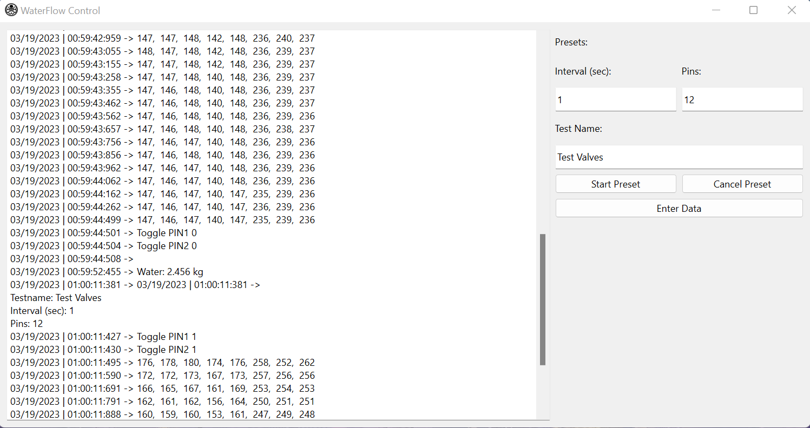

# AV-Waterflow-GUI-V2
Second iteration of the waterflow GUI. Simplified to only preset usage, updated to receive PT data between toggles.

## Dependencies and Running
- Make sure you have Python (3+) installed. 
- Make sure you have pip, or any package manager you are familiar with.
- Install PyQt6: ex - ```pip install PyQt6```
- Install pandas: ex - ```pip install pandas``` *note: this package is currently unused so feel free to delete "import pandas as pd" from GUI.py and ignore this line.
- Install pyserial: ex - ```pip install pyserial```
- To run the program, you may click run in an IDE of your choice
- Or, type ```python3 main.py``` (linux) or ```py main.py``` (windows) from inside the directory where the repository is located.
- If you do not execute the program in the correct directory, you may find that the program cannot "find" certain files. If you are having this issue, try to switch to the correct directory. Alternatively, you can try editing the constants (in blue caps) at the top of the file. Look for the ones that indicate a file path, and replace them with the full path of the file. For example, ```r"C:\Users\Bobjoe\programs\AV-Waterflow-GUI-V2\src\errorIcon.png"``` will replace ```"./src/errorIcon.png"```

## Future Work
I plan to try implementing csv logging in the future (hence pandas import) but it will be some time before I figure out an optimal solution for that, and also what data exactly is desired. 

## GUI Layout


Feel free to reach out to me (Nick Fan, nfan17) if you have any questions or need help.
